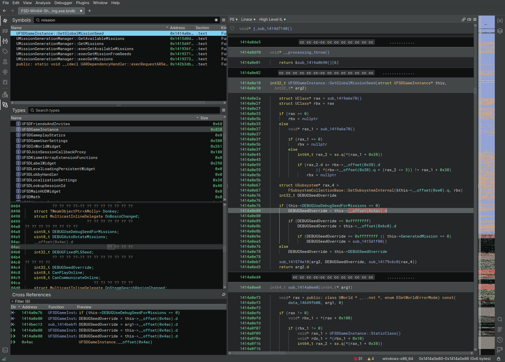
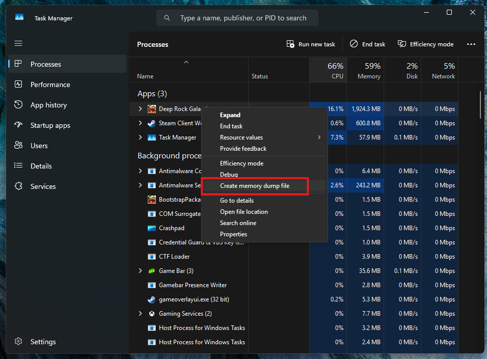
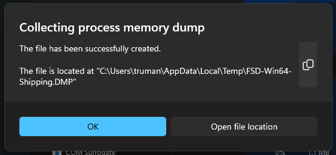

# meatloaf

Work in progress collection of tools for extracting and utilizing Unreal Engine reflection data from compiled binaries.

## [dumper](dumper)

Make sure you are in the dumper project folder before running these commands.

Dump from running process:
```console
cargo run --release -- --pid 12345 output.json
```

Dump from existing full-memory minidump:
```console
cargo run --release -- --minidump FSD-Win64-Shipping.DMP output.json
```

Or output directly to .usmap:
```console
cargo run --release -- --minidump FSD-Win64-Shipping.DMP output.usmap
```

## output
The output JSON is a superset of .usmap and contains enough information to fully reconstruct a matching project in the Unreal Engine editor.

It contains:
- Reflection data for: Classes, Functions, Structs, Enums, etc.
- Class Default Objects (CDOs) and property values

It also does light VTables analysis and dumps approximate VTables for all UObjects found.

## [usmap](usmap)
Crate for reading/writing .usmap files (file format for storing UE reflection data used by numerous modding tools).

## [ue_binja](ue_binja)
Binary Ninja plugin to reconstruct classes and structs from reflection data.



## creating a full game dump

For development and debugging purposes, it is handy to make a full memory dump of the game. Windows makes this really easy via task manager:




After a moment or two the dump should complete:



